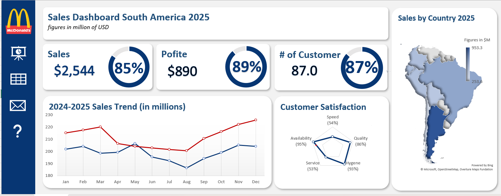

# **MCD South America – Sales Dashboard (Excel)**

## **Dashboard Structure**
This Excel dashboard is designed as a multi-sheet, interactive reporting system rather than a single static sheet.
-	The main dashboard presents high-level KPIs and visual insights.
-	Supporting sheets are logically linked and used for inputs, calculations, and detailed data views.
-	The McDonald’s logo is static and not linked to any sheet.

## Dashboard Preview:

## **Navigation Panel (Left Side Buttons)**
The dashboard includes a custom navigation menu on the left side:
-	Each icon/button is hyperlinked to a specific worksheet
-	Enables smooth navigation between:

*	Dashboard view
*	Input / raw data sheets
*	Supporting analysis sheets
*	Contact / reference sheet
This improves usability, user experience, and simulates a real business reporting tool.

## **Key Dashboard Components**
-	KPI Cards
*	Total Sales
*	Profit
*	Number of Customers
-	Sales Trend Analysis (2024–2025)
*	Monthly comparison using line charts
-	Regional Sales Map
*	Country-wise sales distribution across South America
-	Customer Satisfaction Analysis
*	Radar chart covering service quality metrics
All figures are displayed in millions of USD.

## **Data Handling**
-	Data cleaning and preparation done entirely in Microsoft Excel
-	Used structured tables to support Pivot Tables and charts
-	Ensured consistency across all linked sheets

## **Tools Used**
- Microsoft Excel only
* Pivot Tables & Pivot Charts
* Excel Map Chart
* Hyperlinks for sheet navigation
o	KPI Cards and custom formatting

## **Objective**
  To build a fully interactive Excel dashboard that replicates a real-world business reporting system, allowing stakeholders to navigate seamlessly across different views and understand performance briefly.

